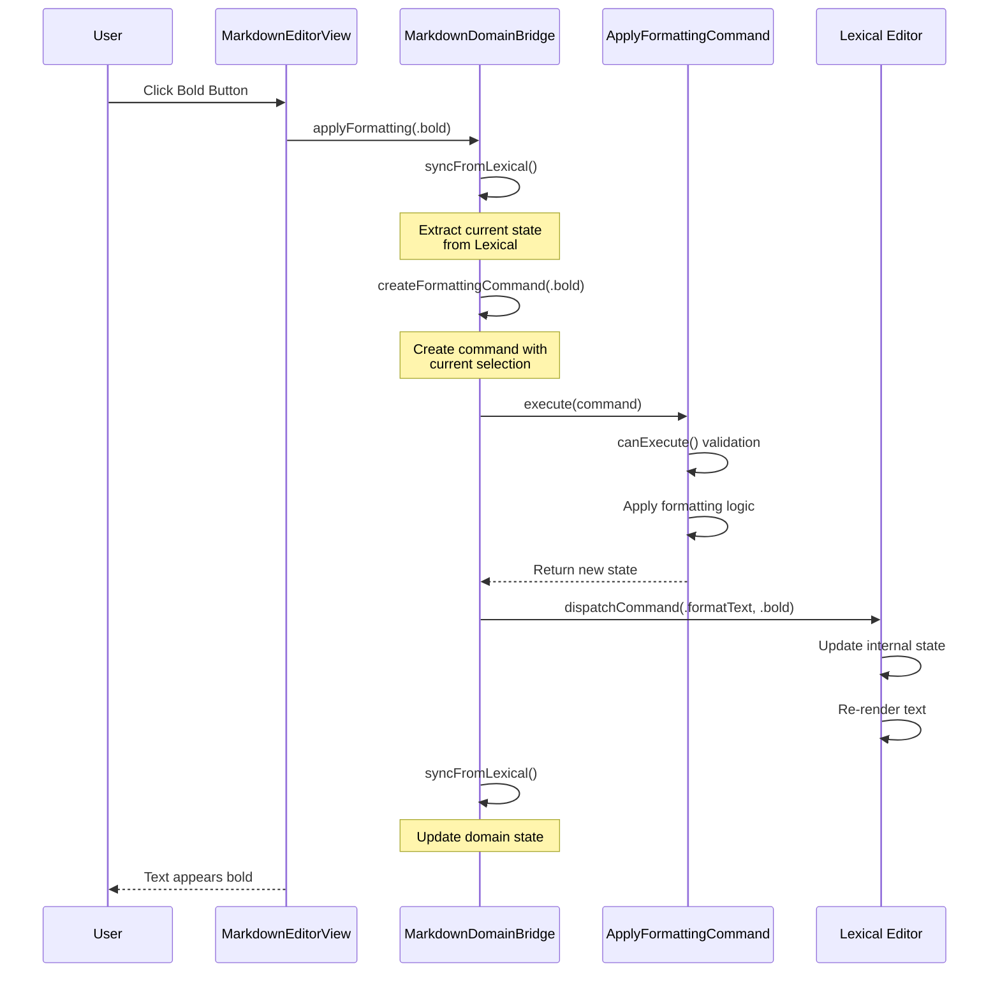
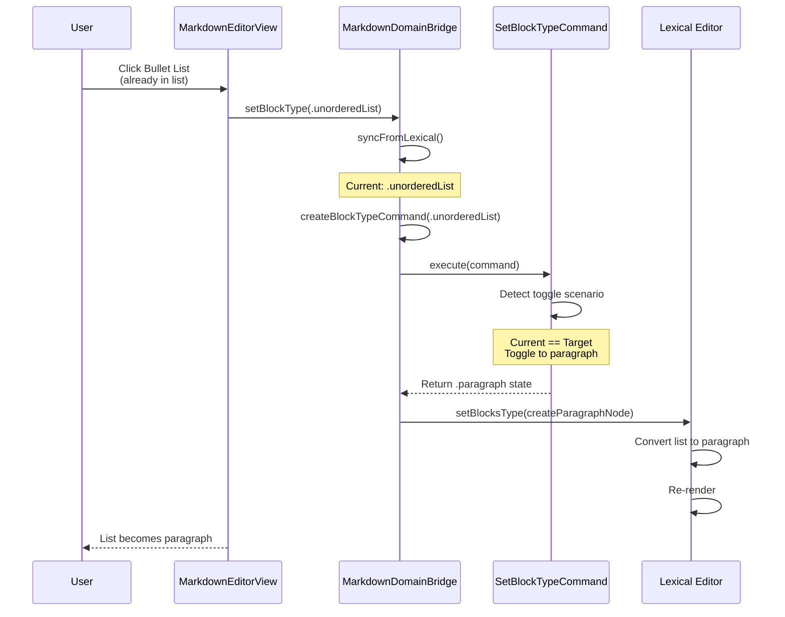
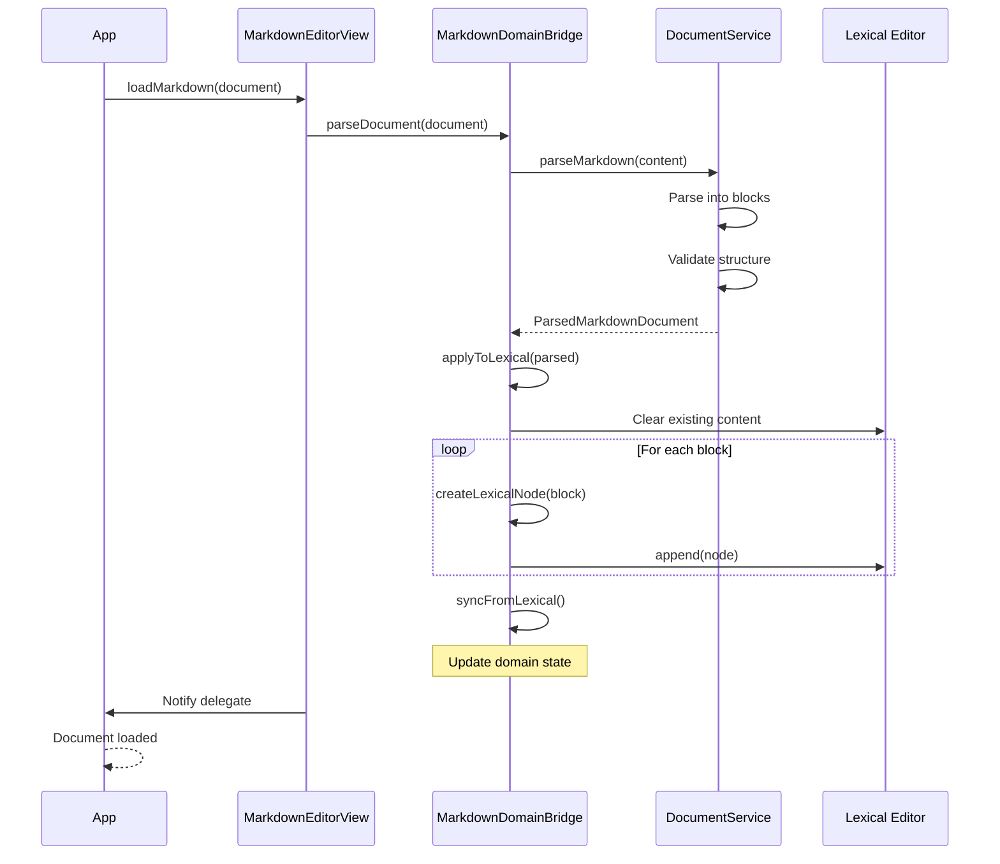
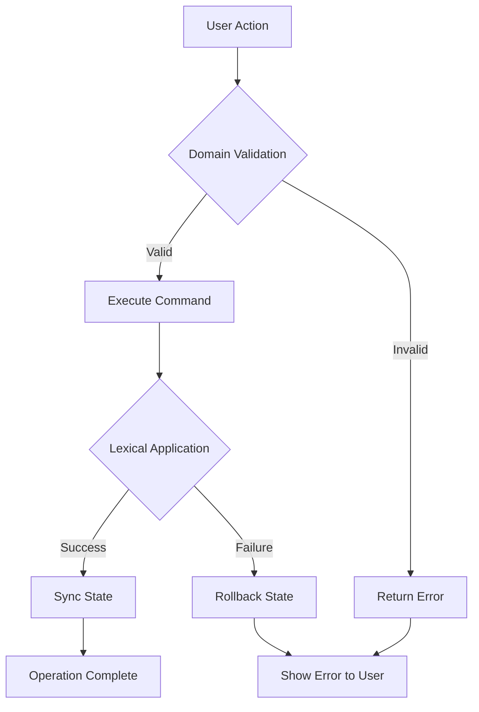

# MarkdownEditor Data Flow Diagrams

## Sequence Diagrams

### 1. Formatting Command Flow



### 2. Smart List Toggle Flow



### 3. Document Loading Flow



## State Management

### Domain State Structure

```
MarkdownEditorState
├── content: String              // Full markdown text
├── selection: TextRange         // Current cursor/selection
├── currentFormatting: InlineFormatting  // Active formats
├── currentBlockType: MarkdownBlockType   // Current block
├── hasUnsavedChanges: Bool
└── metadata: DocumentMetadata
```

### State Synchronization Points

1. **Before Command Execution**
   - `syncFromLexical()` extracts current Lexical state
   - Ensures domain has latest state

2. **After Lexical Operations**
   - `syncFromLexical()` updates domain state
   - Keeps domain in sync with Lexical

3. **On Editor Updates**
   - Update listener triggers sync
   - Maintains consistency during typing

## Command Execution Pipeline

```
1. Create Command
   ├── Capture current state
   ├── Define operation parameters
   └── Set target state

2. Validate Command
   ├── Check if operation is allowed
   ├── Verify state consistency
   └── Apply business rules

3. Execute Command
   ├── Pure function execution
   ├── No side effects
   └── Return new state

4. Apply to Lexical
   ├── Translate to Lexical operations
   ├── Use Lexical's API
   └── Let Lexical handle rendering

5. Sync State
   ├── Extract new Lexical state
   ├── Update domain state
   └── Ready for next command
```

## Error Handling Flow



## Performance Considerations

### Optimization Points

1. **Lazy State Extraction**
   - Only extract what's needed
   - Cache frequently accessed state

2. **Batch Operations**
   - Group related commands
   - Single Lexical update transaction

3. **Selective Sync**
   - Only sync changed portions
   - Avoid full state extraction

### Overhead Analysis

```
Operation          | Domain Overhead | Benefit
-------------------|-----------------|------------------
Format Toggle      | ~1ms           | Testable logic
Block Type Change  | ~2ms           | Smart toggles
State Query        | <1ms           | Cached state
Document Parse     | ~5-10ms        | Validation
```

## Testing Boundaries

### Unit Testable (Domain Only)
- Command execution logic
- State transitions
- Business rule validation
- Document parsing/generation

### Integration Tests (Domain + Lexical)
- Command translation
- State synchronization
- End-to-end operations
- Performance validation

### UI Tests (Full Stack)
- User interactions
- Visual feedback
- Platform integration
- Accessibility